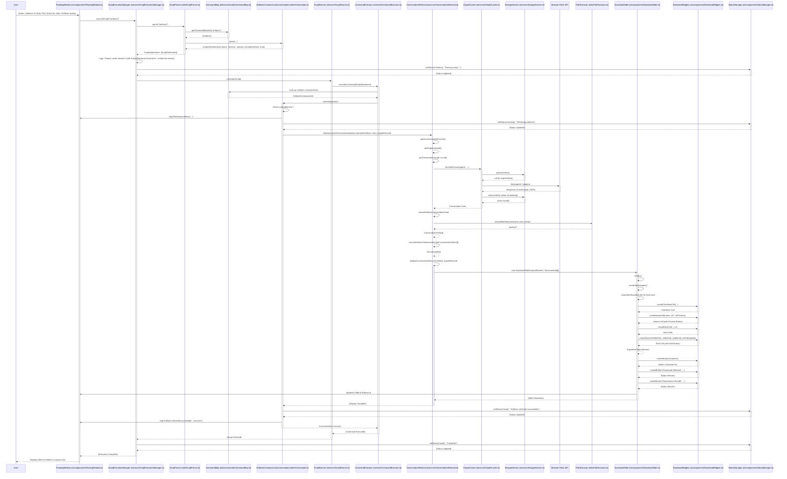

```mermaid
sequenceDiagram
    participant User
    participant FloatingWindow as FloatingWindow (ui/components/FloatingWindow.ts)
    participant ScriptExecMan as ScriptExecutionManager (services/ScriptExecutionManager.ts)
    participant ScriptParser as ScriptParser (utils/ScriptParser.ts)
    participant CommandMap as CommandMap (utils/commands/CommandMap.ts)
    participant ArtifactsCmd as ArtifactsCommand (utils/commands/contentCommands.ts)
    participant ScriptRunner as ScriptRunner (services/ScriptRunner.ts)
    participant CmdExecutor as CommandExecutor (services/CommandExecutor.ts)
    participant ConvRetrieval as ConversationRetrieval (services/ConversationRetrieval.ts)
    participant ClaudeCache as ClaudeCache (services/ClaudeCache.ts)
    participant StorageService as StorageService (services/StorageService.ts)
    participant BrowserFetch as Browser Fetch API
    participant PathExtractor as PathExtractor (utils/PathExtractor.ts)
    participant DownloadTable as DownloadTable (ui/components/DownloadTable.ts)
    participant Widgets as DownloadWidgets (ui/components/DownloadWidgets.ts)
    participant StatusManager as StatusManager (ui/components/StatusManager.ts)

    User->>+FloatingWindow: Enters '/artifacts' & Clicks 'Run Script' (or clicks 'Artifacts' button)
    FloatingWindow->>+ScriptExecMan: executeScript("/artifacts")
    ScriptExecMan->>+ScriptParser: parse("/artifacts")
    ScriptParser->>+CommandMap: getCommandMatches("artifacts")
    CommandMap-->>-ScriptParser: ['artifacts']
    ScriptParser->>+ArtifactsCmd: parse(...)
    ArtifactsCmd-->>-ScriptParser: ScriptStatement{command: 'artifacts', options: {includeArtifacts: true}}
    ScriptParser-->>-ScriptExecMan: Script{statements: [ScriptStatement]}
    ScriptExecMan->>ScriptExecMan: Logs "Project cache cleared" (calls ProjectRetrieval.clearCache - omitted for brevity)
    ScriptExecMan->>+StatusManager: setStatus("working", "Running script...")
    StatusManager-->>-ScriptExecMan: (Status Updated)
    ScriptExecMan->>+ScriptRunner: runScript(Script)
    ScriptRunner->>+CmdExecutor: executeCommand(ScriptStatement)
    CmdExecutor->>+CommandMap: Look up 'artifacts' command info
    CommandMap-->>-CmdExecutor: ArtifactsCommand info
    CmdExecutor->>+ArtifactsCmd: execute(params)
    ArtifactsCmd->>ArtifactsCmd: Clears outputElement (#scriptOutput)
    ArtifactsCmd->>FloatingWindow: log("Retrieving artifacts...")
    ArtifactsCmd->>+StatusManager: setStatus("working", "Retrieving artifacts")
    StatusManager-->>-ArtifactsCmd: (Status Updated)
    ArtifactsCmd->>+ConvRetrieval: displayCurrentConversation(options={includeArtifacts: true}, outputElement)
    ConvRetrieval->>ConvRetrieval: getConversationIdFromUrl()
    ConvRetrieval->>ConvRetrieval: getOrganizationId()
    ConvRetrieval->>+ConvRetrieval: getConversation(orgId, convId)
    ConvRetrieval->>+ClaudeCache: fetchWithCache(apiUrl, ...)
    ClaudeCache->>+StorageService: get(cacheKey)
    StorageService-->>-ClaudeCache: null (or expired data)
    ClaudeCache->>+BrowserFetch: fetch(apiUrl, headers)
    BrowserFetch-->>-ClaudeCache: Response (Conversation JSON)
    ClaudeCache->>+StorageService: set(cacheKey, {data, timestamp})
    StorageService-->>-ClaudeCache: (Data Saved)
    ClaudeCache-->>-ConvRetrieval: Conversation Data
    ConvRetrieval->>ConvRetrieval: extractArtifacts(conversationData)
    ConvRetrieval->>PathExtractor: extractRelPath(content) for each artifact
    PathExtractor-->>ConvRetrieval: filePath?
    ConvRetrieval-->>ConvRetrieval: ConversationArtifact[]
    ConvRetrieval->>ConvRetrieval: convertArtifactsToDocumentInfo(ConversationArtifact[])
    ConvRetrieval-->>ConvRetrieval: DocumentInfo[]
    ConvRetrieval->>+ConvRetrieval: displayConversation(DocumentInfo[], outputElement)
    ConvRetrieval->>+DownloadTable: new DownloadTable(outputElement, DocumentInfo[])
    DownloadTable->>DownloadTable: render()
    DownloadTable->>DownloadTable: createTableHeader()
    DownloadTable->>DownloadTable: createItemRow(docInfo) for each item
    DownloadTable->>+Widgets: createCheckboxCell(...)
    Widgets-->>-DownloadTable: Checkbox Cell
    DownloadTable->>+Widgets: createNameCell(name, url?, onPreview)
    Widgets-->>-DownloadTable: Name Cell (with Preview Button)
    DownloadTable->>+Widgets: createDateCell(...) x2
    Widgets-->>-DownloadTable: Date Cells
    DownloadTable->>+Widgets: createNameCell(filePath, undefined, undefined, onPathUpdate)
    Widgets-->>-DownloadTable: Path Cell (with Edit Button)
    DownloadTable-->>DownloadTable: Populated Table Element
    DownloadTable->>+Widgets: createButtonContainer()
    Widgets-->>-DownloadTable: Button Container Div
    DownloadTable->>+Widgets: createButton("Download Selected", ...)
    Widgets-->>-DownloadTable: Button Element
    DownloadTable->>+Widgets: createButton("Download as Bundle", ...)
    Widgets-->>-DownloadTable: Button Element
    DownloadTable->>FloatingWindow: Appends Table & Buttons to #scriptOutput
    DownloadTable-->>-ConvRetrieval: (Table Rendered)
    ConvRetrieval-->>-ArtifactsCmd: (Display Complete)
    ArtifactsCmd->>+StatusManager: setStatus("ready", "Artifacts retrieved successfully")
    StatusManager-->>-ArtifactsCmd: (Status Updated)
    ArtifactsCmd->>FloatingWindow: log("Artifacts retrieved successfully", "success")
    ArtifactsCmd-->>-CmdExecutor: true (execution success)
    CmdExecutor-->>-ScriptRunner: (Command Executed)
    ScriptRunner-->>-ScriptExecMan: (Script Finished)
    ScriptExecMan->>+StatusManager: setStatus("ready", "Complete")
    StatusManager-->>-ScriptExecMan: (Status Updated)
    ScriptExecMan-->>-FloatingWindow: (Execution Complete)
    FloatingWindow-->>-User: Displays table of artifacts in output area
```