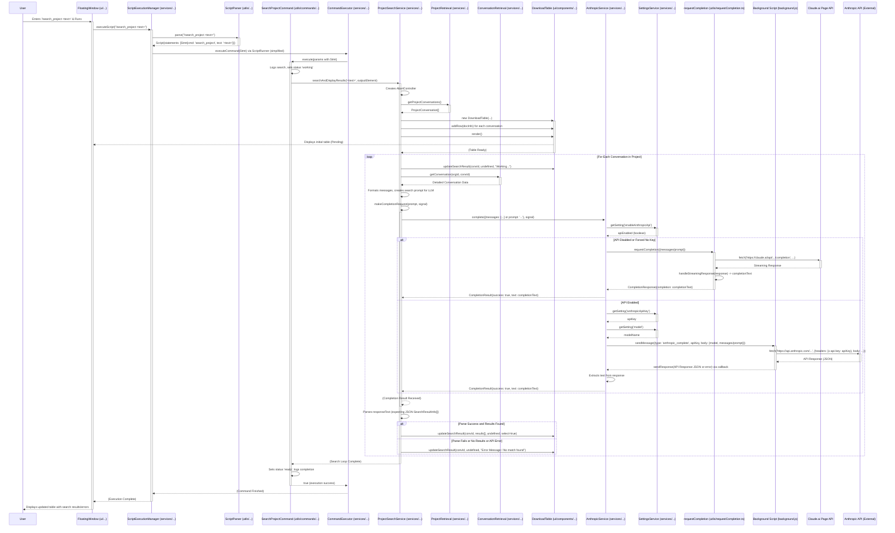

```mermaid
sequenceDiagram
    participant User
    participant FloatingWindow as FloatingWindow (ui/...)
    participant ScriptExecMan as ScriptExecutionManager (services/...)
    participant ScriptParser as ScriptParser (utils/...)
    participant SearchProjCmd as SearchProjectCommand (utils/commands/...)
    participant CmdExecutor as CommandExecutor (services/...)
    participant ProjSearchServ as ProjectSearchService (services/...)
    participant ProjRetrieval as ProjectRetrieval (services/...)
    participant ConvRetrieval as ConversationRetrieval (services/...)
    participant DownloadTable as DownloadTable (ui/components/...)
    participant AnthropicServ as AnthropicService (services/...)
    participant SettingsServ as SettingsService (services/...)
    participant RequestUtil as requestCompletion (utils/requestCompletion.ts)
    participant BackgroundScript as Background Script (background.js)
    participant ClaudePageAPI as Claude.ai Page API
    participant AnthropicAPI as Anthropic API (External)

    %% --- Initial Command Parsing and Execution Setup ---
    User->>+FloatingWindow: Enters '/search_project <text>' & Runs
    FloatingWindow->>+ScriptExecMan: executeScript("/search_project <text>")
    ScriptExecMan->>+ScriptParser: parse("/search_project <text>")
    ScriptParser-->>-ScriptExecMan: Script{statements: [Stmt{cmd: 'search_project', text: '<text>'}]}
    ScriptExecMan->>+CmdExecutor: executeCommand(Stmt) via ScriptRunner (simplified)
    CmdExecutor->>+SearchProjCmd: execute(params with Stmt)
    SearchProjCmd->>SearchProjCmd: Logs search, sets status 'working'
    SearchProjCmd->>+ProjSearchServ: searchAndDisplayResults('<text>', outputElement)

    %% --- Search Service: Setup and Loop Start ---
    ProjSearchServ->>ProjSearchServ: Creates AbortController
    ProjSearchServ->>+ProjRetrieval: getProjectConversations()
    ProjRetrieval-->>-ProjSearchServ: ProjectConversation[]
    ProjSearchServ->>+DownloadTable: new DownloadTable(...)
    ProjSearchServ->>DownloadTable: addRow(docInfo) for each conversation
    ProjSearchServ->>DownloadTable: render()
    DownloadTable-->>FloatingWindow: Displays initial table (Pending)
    DownloadTable-->>-ProjSearchServ: (Table Ready)

    loop For Each Conversation in Project
        ProjSearchServ->>DownloadTable: updateSearchResult(convId, undefined, "Working...")
        ProjSearchServ->>+ConvRetrieval: getConversation(orgId, convId)
        ConvRetrieval-->>-ProjSearchServ: Detailed Conversation Data
        ProjSearchServ->>ProjSearchServ: Formats messages, creates search prompt for LLM
        ProjSearchServ->>+ProjSearchServ: makeCompletionRequest(prompt, signal)
        ProjSearchServ->>+AnthropicServ: complete({messages: [...] or prompt: '...'}, signal)

        %% --- Branching Logic for Completion ---
        AnthropicServ->>+SettingsServ: getSetting('enableAnthropicApi')
        SettingsServ-->>-AnthropicServ: apiEnabled (boolean)

        alt API Disabled or Forced No Key
            AnthropicServ->>+RequestUtil: requestCompletion({messages/prompt})
            RequestUtil->>+ClaudePageAPI: fetch('https://claude.ai/api/.../completion', ...)
            ClaudePageAPI-->>-RequestUtil: Streaming Response
            RequestUtil->>RequestUtil: handleStreamingResponse(response) -> completionText
            RequestUtil-->>-AnthropicServ: CompletionResponse{completion: completionText}
            AnthropicServ-->>ProjSearchServ: CompletionResult{success: true, text: completionText}
        else API Enabled
            AnthropicServ->>+SettingsServ: getSetting('anthropicApiKey')
            SettingsServ-->>-AnthropicServ: apiKey
            AnthropicServ->>+SettingsServ: getSetting('model')
            SettingsServ-->>-AnthropicServ: modelName
            AnthropicServ->>+BackgroundScript: sendMessage({type: 'anthropic_complete', apiKey, body: {model, messages/prompt}})
            BackgroundScript->>+AnthropicAPI: fetch('https://api.anthropic.com/...', {headers: {x-api-key: apiKey}, body: ...})
            AnthropicAPI-->>-BackgroundScript: API Response (JSON)
            BackgroundScript-->>-AnthropicServ: sendResponse(API Response JSON or error) via callback
            AnthropicServ->>AnthropicServ: Extracts text from response
            AnthropicServ-->>ProjSearchServ: CompletionResult{success: true, text: completionText}
        end

        %% --- Processing Completion Result ---
        ProjSearchServ-->>-ProjSearchServ: (Completion Result Received)
        ProjSearchServ->>ProjSearchServ: Parses responseText (expecting JSON SearchResultInfo[])
        alt Parse Success and Results Found
            ProjSearchServ->>DownloadTable: updateSearchResult(convId, results[], undefined, select=true)
        else Parse Fails or No Results or API Error
            ProjSearchServ->>DownloadTable: updateSearchResult(convId, undefined, "Error Message / No match found")
        end

    end

    %% --- Final Steps ---
    ProjSearchServ-->>-SearchProjCmd: (Search Loop Complete)
    SearchProjCmd->>SearchProjCmd: Sets status 'ready', logs completion
    SearchProjCmd-->>-CmdExecutor: true (execution success)
    CmdExecutor-->>ScriptExecMan: (Command Finished)
    ScriptExecMan-->>-FloatingWindow: (Execution Complete)
    FloatingWindow-->>-User: Displays updated table with search results/errors
```
