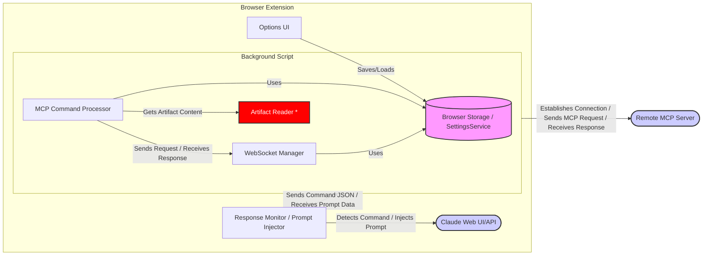

Okay, here is an architecture document outlining the integration of MCP client functionality into the Claude PS extension.

````markdown
# Architecture: MCP Client Integration for Claude PS Extension

## 1. Overview

This document outlines the architecture for extending the Claude PS browser extension to act as a Model Context Protocol (MCP) client. The goal is to enable the extension to detect MCP commands embedded in Claude's responses, communicate with a configured remote MCP server via WebSocket, handle responses, and potentially perform special actions like reading local artifacts before contacting the server.

## 2. Goals

- Detect specific JSON payloads within Claude's responses indicating an MCP command.
- Establish and manage a WebSocket connection to a configurable remote MCP server.
- Send MCP requests based on detected commands to the server.
- Handle special commands locally within the extension (e.g., `write_artifact`) before sending data to the server.
- Receive responses from the MCP server.
- Use the server's response to formulate a new prompt for Claude.
- Provide a mechanism for users to configure the MCP server connection details (URL, optional authentication key).

## 3. Assumptions

- The "Claude PS extension" is a browser extension (e.g., Chrome Extension) interacting with the Claude web interface or API.
- The extension has the necessary components like background scripts and potentially content scripts to intercept or observe Claude's responses.
- MCP commands from Claude will be embedded within a specific, identifiable Markdown block (e.g., a fenced code block with a specific language identifier like `mcp`).
- ```mcp
    {
      "command": "some_tool_name",
      "arguments": { "param1": "value1" }
    }
  ```
- The extension uses browser storage (e.g., `chrome.storage` or similar) for settings, potentially managed by the existing `SettingsService`.

## 4. Architecture Components

We will introduce or modify the following components:

1.  **MCP Configuration UI (Options Page):**

    - Allows users to input and save the MCP Server WebSocket URL (e.g., `wss://your-mcp-server.com:port`) and an optional Authentication Key.
    - Uses the extension's storage mechanism (via `SettingsService`) to persist these settings.

2.  **Response Monitor (Content Script or Background Script):**

    - Observes responses generated by Claude. The exact mechanism depends on how the extension currently interacts with Claude (DOM monitoring, intercepting network requests, etc.).
    - Parses responses to detect the specific Markdown block containing the MCP JSON payload.

3.  **MCP Command Processor (Background Script):**

    - Receives the detected MCP JSON payload from the Response Monitor.
    - Parses the JSON to identify the `command` and `arguments`.
    - Implements special handling logic (e.g., for `write_artifact`).
    - Formats the final MCP request payload to be sent to the server.
    - Interacts with the `WebSocket Manager`.

4.  **WebSocket Manager (Background Script):**

    - Retrieves MCP server configuration (URL, Key) from storage (via `SettingsService`).
    - Establishes and maintains the WebSocket connection to the MCP server.
    - Handles authentication (e.g., sending the key upon connection).
    - Sends formatted MCP requests received from the `MCP Command Processor`.
    - Receives responses from the MCP server.
    - Manages connection state (connecting, open, closed, error) and reconnection logic.
    - Forwards server responses back to the `MCP Command Processor`.

5.  **Artifact Reader (Background Script - _Requires careful consideration_):**

    - Handles the `write_artifact` command.
    - Receives the artifact name/identifier from the `MCP Command Processor`.
    - **Challenge:** Browser extensions have limited file system access. This might require:
      - Using the `chrome.fileSystemProvider` API (complex, might be overkill).
      - Prompting the user to select the artifact file via a standard file input dialog.
      - Accessing only files within the extension's own sandboxed storage if artifacts are managed there.
    - Reads the content of the specified artifact.
    - Returns the content to the `MCP Command Processor` to be included in the request to the MCP server.

6.  **Prompt Injector (Content Script or Background Script):**
    - Receives the processed response from the MCP server (via `MCP Command Processor`).
    - Formats this response into a new prompt suitable for Claude.
    - Injects or sends this new prompt back into the Claude interface/API to continue the conversation.

## 5. Mermaid Diagrams

### 5.1. Component Diagram


````

_Note: The Artifact Reader component requires careful implementation due to browser security restrictions._

### 5.2. Sequence Diagram: Standard MCP Command Flow

```mermaid
sequenceDiagram
    participant Claude as Claude UI/API
    participant Monitor as Response Monitor (CS)
    participant Processor as MCP Command Processor (BG)
    participant WSMan as WebSocket Manager (BG)
    participant Server as Remote MCP Server
    participant Injector as Prompt Injector (CS)

    Claude ->>+ Monitor: Sends Response containing MCP block
    Monitor ->>+ Processor: Extracts and forwards MCP JSON
    Processor ->>+ WSMan: Formats and sends MCP Request
    WSMan ->>+ Server: Sends MCP Request via WebSocket
    Server ->>- WSMan: Sends MCP Response via WebSocket
    WSMan ->>- Processor: Forwards MCP Response
    Processor ->>- Injector: Sends processed response data
    Injector ->>- Claude: Sends new prompt based on MCP response
    Monitor -->>- Claude: (Cleanup/UI update)
```

### 5.3. Sequence Diagram: `write_artifact` Command Flow

```mermaid
sequenceDiagram
    participant Claude as Claude UI/API
    participant Monitor as Response Monitor (CS)
    participant Processor as MCP Command Processor (BG)
    participant ArtifactR as Artifact Reader (BG)
    participant User as User (Interaction)
    participant WSMan as WebSocket Manager (BG)
    participant Server as Remote MCP Server
    participant Injector as Prompt Injector (CS)

    Claude ->>+ Monitor: Sends Response (e.g., `write_artifact`, name: "report.txt")
    Monitor ->>+ Processor: Extracts MCP JSON ("write_artifact", {name: "report.txt"})
    Processor ->>+ ArtifactR: Request artifact content ("report.txt")

    %% Option 1: File Picker Interaction
    ArtifactR ->> User: Prompt for file selection ("report.txt")
    User -->> ArtifactR: Selects file
    ArtifactR ->> ArtifactR: Read file content

    %% Option 2: Accessing known location (less likely/secure)
    %% ArtifactR ->> ArtifactR: Read artifact from predefined location/storage


    ArtifactR ->>- Processor: Return artifact content ("File content...")
    Processor ->> Processor: Format MCP request with artifact content
    Processor ->>+ WSMan: Sends MCP Request (with artifact content)
    WSMan ->>+ Server: Sends MCP Request via WebSocket
    Server ->>- WSMan: Sends MCP Response via WebSocket
    WSMan ->>- Processor: Forwards MCP Response
    Processor ->>- Injector: Sends processed response data
    Injector ->>- Claude: Sends new prompt based on MCP response
    Monitor -->>- Claude: (Cleanup/UI update)

```

## 6. Configuration

The following settings need to be stored, likely using `chrome.storage.sync` or `chrome.storage.local` via the existing `SettingsService`:

- `mcpServerUrl`: (String) The full WebSocket URL (e.g., `wss://server.example.com:8765`).
- `mcpAuthKey`: (String, optional) The authentication key sent to the server upon connection.

These will be managed via the extension's options page.

## 7. Communication Protocol (WebSocket)

1.  **Connection:** The `WebSocket Manager` attempts to connect to the `mcpServerUrl` when the extension starts or when settings change.
2.  **Authentication:** If `mcpAuthKey` is configured, it should be sent immediately after the WebSocket connection is established, according to the MCP server's expected protocol (e.g., as the first message).
3.  **Request:** MCP requests (JSON format, potentially derived from the structure Claude provides) are sent as WebSocket messages.
4.  **Response:** The client listens for incoming WebSocket messages, which are expected to be the MCP server's JSON responses.
5.  **Error Handling:** Implement listeners for `onerror` and `onclose` events. Attempt reconnection with backoff strategy if the connection drops unexpectedly. Surface persistent errors to the user.

## 8. Special Handling: `write_artifact`

- When the `MCP Command Processor` detects the `write_artifact` command, it will _not_ immediately forward the request.
- It extracts the artifact identifier (e.g., filename) from the arguments.
- It invokes the `Artifact Reader`.
- **Crucially:** The `Artifact Reader` needs a mechanism to access the artifact content. Prompting the user via a file input seems the most viable and secure approach for a standard browser extension. The architecture must account for this user interaction step.
- Once the content is retrieved, the `MCP Command Processor` replaces or adds the content to the arguments sent to the MCP server via the `WebSocket Manager`.

## 9. Security Considerations

- **Authentication Key:** Store the `mcpAuthKey` securely. Using `chrome.storage.local` is generally preferred over `sync` for sensitive data, although neither is perfectly secure from local attacks on the user's machine. Avoid hardcoding keys.
- **Server Trust:** The extension implicitly trusts the configured MCP server. Ensure users understand the implications of configuring a server URL. Use `wss://` (secure WebSockets) for encrypted communication.
- **Artifact Access:** Accessing local files (`write_artifact`) is sensitive.
  - Clearly explain to the user why file access is needed.
  - Use the least permissive method possible (e.g., user-initiated file selection).
  - Validate artifact identifiers to prevent path traversal or access to unintended files if a non-interactive method is chosen (though this is difficult and risky in a browser extension context).

## 10. Future Considerations

- Support for other transport protocols (e.g., SSE over HTTP).
- More sophisticated error reporting and status indication to the user.
- Caching MCP server capabilities (tools/resources list).
- Handling concurrent MCP requests if necessary.

```

```
