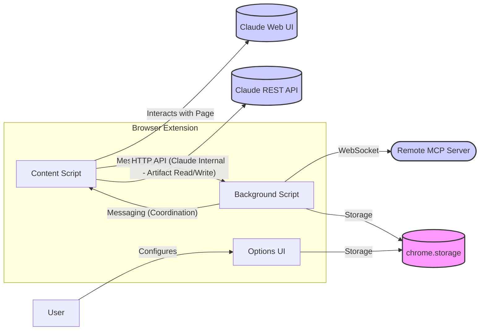
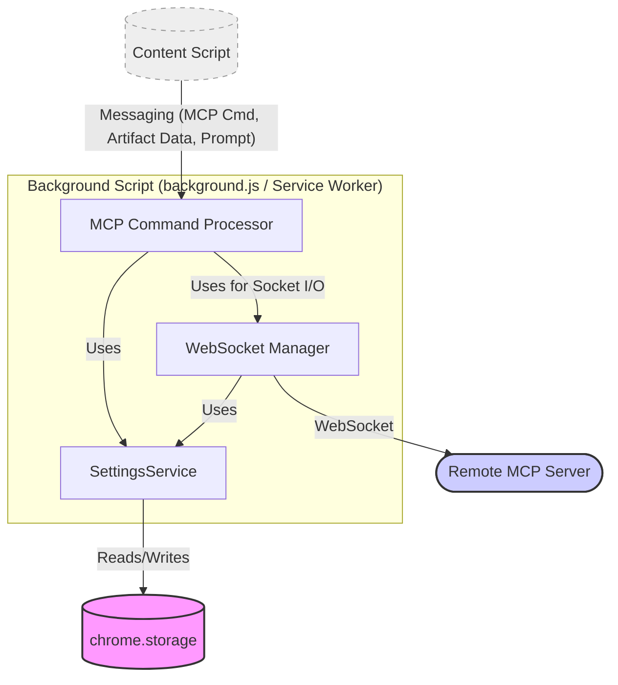

<!--
Copyright (c) 2025 Martin Bechard [martin.bechard@DevConsult.ca](mailto:martin.bechard@DevConsult.ca)
This software is licensed under the MIT License.
path: design/mcp-client-design.md
This was generated by Gemini 2 with the assistance of my human mentor
Summary: Architecture design for integrating MCP client functionality into the Claude PS Extension.
Witty remark: Connecting Claude to the Matrix... now with diagrams focused solely on the MCP mission and *actually* correct syntax!
-->

# Architecture: MCP Client Integration for Claude PS Extension (Revised)

## 1. Overview

This document outlines the architecture for extending the Claude PS browser extension to act as a Model Context Protocol (MCP) client. The goal is to enable the extension to detect MCP commands embedded in Claude's responses, communicate with a configured remote MCP server via WebSocket, handle responses, interact with Claude's APIs for artifact management (coordinating between Background and Content Scripts), and inject prompts back to Claude, allowing Claude to trigger actions on the MCP server.

## 2. Goals

- Detect specific JSON payloads within Claude's responses indicating an MCP command.
- Establish and manage a WebSocket connection to a configurable remote MCP server (from Background Script).
- Send MCP requests based on detected commands to the server (via Background Script).
- Handle specific commands by coordinating between Background and Content Scripts to interact with Claude's APIs (e.g., retrieving artifact content via Content Script using `ConversationRetrieval` logic to send to the MCP server, or saving content received from the MCP server as an artifact via Content Script).
- Receive responses from the MCP server (in Background Script).
- Use the server's response to formulate a new prompt for Claude (sent to Content Script).
- Provide a mechanism for users to configure the MCP server connection details (URL, optional authentication key, enable/disable toggle).

## 3. Assumptions

- The "Claude PS extension" is a browser extension (e.g., Chrome Extension) interacting with the Claude web interface or API.
- The extension has necessary components like `background.js` (or Service Worker), `content.ts`, `SettingsService`, `ConversationRetrieval.ts`, `getClaudeIds.ts`.
- Functions requiring `window` or `document` access (like those in `getClaudeIds.ts` and used by `ConversationRetrieval.ts`) **must** run in the **Content Script**.
- API calls to Claude's _internal_ APIs (like fetching conversation/artifact data via `ConversationRetrieval.ts`) require context/headers obtained from the **Content Script**.
- MCP commands from Claude will be embedded within a specific, identifiable Markdown block (e.g., a fenced code block with the `json` language identifier).
  ```json
  {
    "command": "some_tool_name",
    "arguments": { "param1": "value1" }
  }
  ```
- The extension uses browser storage (`chrome.storage`) managed by the existing `SettingsService`.
- All components within the "Background Script" context run within the same execution environment.

## 4. Architecture Components (Refined & Integrated)

1.  **MCP Configuration UI (Options Page):**

    - (Unchanged) Extends `options.html`/`.js`, uses `SettingsService`.

2.  **Response Monitor & Detector (Content Script / Utils):**

    - (Unchanged) Integrated into response processing (e.g., `ScriptRunner`). Detects ` ```json ... ``` ` blocks. Sends detected JSON to Background Script via `chrome.runtime.sendMessage`.

3.  **MCP Command Processor (Background Script):**

    - **Location:** Resides in the `Background Script`.
    - **Functionality:** Orchestrates MCP interactions. Receives MCP JSON from Content Script. Parses command/arguments.
      - **Handles `send_artifact_to_mcp`:** Sends a message **to the Content Script** requesting the content for the specified artifact ID (or potentially conversation ID + artifact name). Upon receiving the content back from the Content Script, prepares the MCP request and calls methods on the `WebSocket Manager` to send it.
      - **Handles `retrieve_file_from_mcp`:** Calls methods on the `WebSocket Manager` to send the request to the MCP server. On receiving file content via callback/promise from the `WebSocket Manager`, sends a message **to the Content Script** containing the filename and content, requesting it to save the artifact via Claude's API. Waits for confirmation/result from Content Script.
      - **Handles standard commands:** Prepares the MCP request and calls methods on the `WebSocket Manager` to send it.
    - Receives responses via callback/promise from the `WebSocket Manager`. Receives confirmation/results for artifact operations from Content Script. Sends final processed results (ready for Claude prompt) back to the Content Script.

4.  **WebSocket Manager (Background Script):**

    - (Unchanged) Manages the WebSocket connection itself. Called by `MCP Command Processor` to send data; passes received data back to `MCP Command Processor`.

5.  **Artifact Handling Logic (Content Script):**

    - **Location:** Resides in the **Content Script** (potentially enhancing `ConversationRetrieval.ts` or a new utility/service).
    - **Functionality:** Handles messages from the Background Script related to artifacts.
      - **On request for artifact content:** Uses `ConversationRetrieval.getConversation` (or similar logic) to fetch the relevant conversation data from Claude's API, extracts the specific artifact content, and sends the content back to the Background Script. Requires access to IDs/headers from the Content Script context.
      - **On request to save artifact:** Takes filename and content received from the Background Script. Makes the necessary API call to Claude's API (endpoint TBD) to save/create the artifact, likely requiring Content Script context/headers. Sends confirmation/result back to the Background Script.
    - **Note:** The Background Script _coordinates_ artifact actions, but the Content Script _executes_ the Claude API calls for them using existing services like `ConversationRetrieval` where applicable.

6.  **Prompt Injector (Content Script):**
    - (Unchanged) Integrates with existing prompt submission logic. Receives final prompt text from Background Script and injects it.

## 5. Mermaid Diagrams

### 5.1. Overall Architecture Diagram (Focused on MCP, Clarified Artifact API)

(Remains unchanged from previous version)



_(Note: Messaging between Content/Background scripts is for coordination. Content Script directly handles Claude Internal APIs for artifacts. Background Script handles the MCP WebSocket connection.)_

### 5.2. Background Script Internals Diagram (Focused on MCP)

(Remains unchanged from previous version)



_(Note: Shows components directly involved in MCP processing within the background context.)_

### 5.3. Sequence Diagram: Sending Artifact Content to MCP Server (Corrected Participant Syntax)

```mermaid
sequenceDiagram
    participant ClaudeUI as Claude UI/API
    participant CS as Content Script
    participant Processor as MCP Command Processor (BG)
    participant ConvRetrieval as ConversationRetrieval (CS)
    participant ClaudeAPI as Claude REST API
    participant WSMan as WebSocket Manager (BG)
    participant Server as Remote MCP Server

    ClaudeUI ->>+ CS: Sends Response (e.g., command to send artifact 'doc.txt' to MCP)
    CS ->>+ Processor: Extracts & Forwards MCP JSON (e.g., {cmd: 'send_artifact', args: {id: 'doc.txt'}})
    activate Processor
    Processor ->>+ CS: Request Artifact Content ('doc.txt')
    activate CS
    CS ->>+ ConvRetrieval: getConversation(orgId, convId) or similar to get artifact data
    activate ConvRetrieval
    ConvRetrieval ->>+ ClaudeAPI: GET /api/.../chat_conversations/{convId} (using CS context)
    activate ClaudeAPI
    ClaudeAPI ->>- ConvRetrieval: Return Conversation Data
    deactivate ClaudeAPI
    ConvRetrieval ->> ConvRetrieval: Extract content for 'doc.txt'
    ConvRetrieval ->>- CS: Return artifact content ("File content...")
    deactivate ConvRetrieval
    CS ->>- Processor: Send Artifact Content Back
    deactivate CS
    Processor ->> Processor: Format MCP request (e.g., {cmd: 'save_data', args: {name: 'doc.txt', content: "..."}})
    Processor ->>+ WSMan: Calls sendMessage(request)
    activate WSMan
    WSMan ->>+ Server: Sends MCP Request via WebSocket
    activate Server
    Server ->>- WSMan: Sends MCP Response (e.g., success/failure)
    deactivate Server
    WSMan ->>- Processor: Passes response back
    deactivate WSMan
    Processor ->> CS: Sends processed response data (for next Claude prompt)
    deactivate Processor # Processor sends last message in this block
    activate CS
    CS ->> ClaudeUI: Injects new prompt
    deactivate CS # CS sends last message in this block
    CS -->>- ClaudeUI: (Cleanup/UI update) # Dashed arrow doesn't affect activation
```

### 5.4. Sequence Diagram: Retrieving File from MCP Server and Saving as Artifact (Corrected Participant Syntax)

```mermaid
sequenceDiagram
    participant ClaudeUI as Claude UI/API
    participant CS as Content Script
    participant Processor as MCP Command Processor (BG)
    participant WSMan as WebSocket Manager (BG)
    participant Server as Remote MCP Server
    participant ClaudeAPI as Claude REST API

    ClaudeUI ->>+ CS: Sends Response (e.g., command to get 'report.csv' from MCP)
    CS ->>+ Processor: Extracts & Forwards MCP JSON (e.g., {cmd: 'get_file', args: {filename: 'report.csv'}})
    activate Processor
    Processor ->>+ WSMan: Calls sendMessage(request to get file)
    activate WSMan
    WSMan ->>+ Server: Sends MCP Request ('get_file', {filename: 'report.csv'}) via WebSocket
    activate Server
    Server ->>- WSMan: Sends MCP Response (with file content: "CSV data...")
    deactivate Server
    WSMan ->>- Processor: Passes response back (with content)
    deactivate WSMan
    Processor ->>+ CS: Request Save Artifact ('report.csv', "CSV data...")
    activate CS
    CS ->>+ ClaudeAPI: POST /api/artifacts (or similar endpoint, using CS context)
    activate ClaudeAPI
    ClaudeAPI ->>- CS: Return success/failure (e.g., new artifact ID)
    deactivate ClaudeAPI
    CS ->>- Processor: Send Save Result Back
    deactivate CS
    Processor ->> CS: Sends processed response data (e.g., "Saved file as artifact report.csv")
    deactivate Processor # Processor sends last message in this block
    activate CS
    CS ->> ClaudeUI: Injects new prompt
    deactivate CS # CS sends last message in this block
    CS -->>- ClaudeUI: (Cleanup/UI update) # Dashed arrow doesn't affect activation
```

## 6. Configuration

(Remains the same)

## 7. Communication Protocol (WebSocket)

(Remains the same)

## 8. Special Handling (Revised based on Context)

- **Sending Artifacts to MCP:** The `MCP Command Processor` (Background) receives the command, requests the content from the **Content Script** (which uses `ConversationRetrieval` logic), receives the content back, and then delegates sending to the `WebSocket Manager` (Background).
- **Saving Content from MCP as Artifact:** The `MCP Command Processor` (Background) receives the content from the `WebSocket Manager` (Background), then requests the **Content Script** to perform the save operation via Claude's API, and waits for confirmation.
- **No User File Interaction:** Remains true.

## 9. Security Considerations

(Revised to remove Anthropic API mention)

- **Authentication Key:** Store `mcpAuthKey` using `chrome.storage.local`. Avoid hardcoding.
- **Server Trust:** Extension trusts the configured MCP server. Enforce `wss://`. Users must understand the implications of the configured URL.
- **API Keys/Auth:**
  - **Claude Internal APIs:** Authentication relies on the user's logged-in session cookies/headers accessed by the **Content Script**.
- **Data Handling:** Be mindful of data sensitivity when handling artifact content.

## 10. Future Considerations

(Remains the same)
