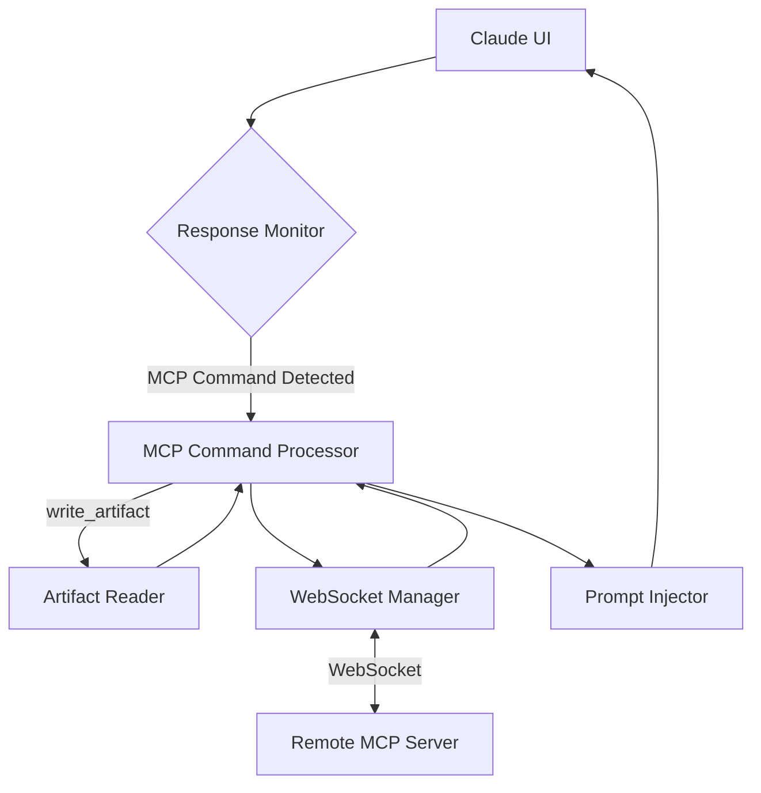

# MCP Client Implementation Plan

## 1. Overview

This document outlines the implementation plan for extending the Claude PS browser extension to act as a Model Context Protocol (MCP) client. The MCP client will enable the extension to:

1. Detect MCP commands embedded in Claude's responses
2. Communicate with a remote MCP server via WebSocket
3. Handle responses from the MCP server
4. Process special commands locally when needed
5. Formulate new prompts for Claude based on server responses

## 2. System Architecture

The MCP client feature will be composed of several key components that work together:



### Core Components

1. **MCP Configuration UI** - For WebSocket URL and Auth Key settings
2. **Response Monitor** - To detect MCP commands in Claude responses
3. **MCP Command Processor** - To parse and process commands
4. **WebSocket Manager** - To handle connections to the MCP server
5. **Artifact Reader** - To handle local operations like `write_artifact`
6. **Prompt Injector** - To formulate and inject new prompts to Claude

## 3. Implementation Plan

### 3.1 MCP Configuration and Settings

1. **Extend SettingsService for MCP settings**
   - Add MCP server URL, authentication key, and enabled flag
   - Implement validation for these settings
   - BECAUSE configuration is needed before functional components
   - BECAUSE this leverages existing settings infrastructure

   ```typescript
   // Add to SettingsService.ts
   public static validateMcpUrl(url: string): string | null {
     if (!url.startsWith('wss://')) {
       return 'WebSocket URL must start with "wss://" for security';
     }
     
     try {
       new URL(url); // Validates URL format
       return null;
     } catch (error) {
       return 'Invalid URL format';
     }
   }
   ```

2. **Add MCP Configuration UI**
   - Extend options page with MCP settings section
   - Add test connection button and feedback
   - BECAUSE users need to configure the feature before use
   - BECAUSE early UI work provides visible progress

   ```html
   <div class="form-group" id="mcpConfigGroup">
     <h3>Model Context Protocol (MCP) Settings</h3>
     <div class="toggle-group">
       <input type="checkbox" id="enableMcp" />
       <label for="enableMcp">Enable MCP Client</label>
     </div>
     <div class="form-group">
       <label for="mcpServerUrl">MCP Server WebSocket URL</label>
       <input type="text" id="mcpServerUrl" placeholder="wss://your-mcp-server.com:8765" />
     </div>
     <div class="form-group">
       <label for="mcpAuthKey">Authentication Key (Optional)</label>
       <input type="password" id="mcpAuthKey" />
     </div>
     <button type="button" id="testMcpConnection">Test Connection</button>
   </div>
   ```

### 3.2 Command Detection and Monitoring

3. **Create MCPCommandDetector**
   - Implement pattern detection for MCP commands in Claude responses
   - Add JSON parsing for command extraction
   - BECAUSE command detection is the entry point for functionality
   - BECAUSE this verifies we can identify commands correctly

   ```typescript
   class MCPCommandDetector {
     static detect(text: string): MCPCommand[] {
       // Look for code blocks with mcp language identifier
       const mcpBlockRegex = /```mcp\s+([\s\S]+?)```/g;
       const commands: MCPCommand[] = [];
       
       let match;
       while ((match = mcpBlockRegex.exec(text)) !== null) {
         try {
           const command = JSON.parse(match[1]);
           commands.push(command);
         } catch (error) {
           console.error("Failed to parse MCP command:", error);
         }
       }
       
       return commands;
     }
   }
   ```

4. **Create MCPResponseMonitor**
   - Implement MutationObserver-based response detection
   - Add command extraction using the detector
   - BECAUSE continuous monitoring of Claude responses is required
   - BECAUSE DOM changes need reliable detection

   ```typescript
   export class MCPResponseMonitor {
     private observer: MutationObserver | null = null;
     
     public async initialize(): Promise<void> {
       // Set up observer for Claude's responses
       this.observer = new MutationObserver(this.handleMutations.bind(this));
       
       // Find Claude's response container
       const responseContainer = await this.findResponseContainer();
       if (responseContainer) {
         this.observer.observe(responseContainer, {
           childList: true,
           subtree: true,
           characterData: true
         });
       }
     }
     
     private handleMutations(mutations: MutationRecord[]): void {
       for (const mutation of mutations) {
         // Check if this might be a new response
         if (this.isNewResponse(mutation)) {
           const content = this.extractResponseContent(mutation.target as Element);
           const commands = MCPCommandDetector.detect(content);
           
           if (commands.length > 0) {
             // Send commands to background script
             chrome.runtime.sendMessage({
               type: "mcp_command",
               commands: commands
             });
           }
         }
       }
     }
   }
   ```

5. **Integrate: Add monitoring to ClaudeExtension**
   - Extend ClaudeExtension to initialize MCPResponseMonitor
   - Add logging of detected commands
   - BECAUSE early integration validates detection in the real environment
   - BECAUSE this confirms our DOM monitoring approach works

   ```typescript
   // Add to ClaudeExtension.ts
   export class ClaudeExtension {
     private floatingWindow: FloatingWindow;
     private scriptRunner: ScriptRunner | null = null;
     // Add new MCP components
     private mcpResponseMonitor: MCPResponseMonitor | null = null;
     
     private async initialize(): Promise<void> {
       try {
         // ... existing initialization ...
         
         // Initialize MCP components if enabled
         const mcpEnabled = await SettingsService.getSetting("mcpEnabled");
         if (mcpEnabled) {
           this.mcpResponseMonitor = new MCPResponseMonitor();
           await this.mcpResponseMonitor.initialize();
           this.logToOutput("MCP monitoring initialized");
         }
       } catch (error) {
         console.error("Failed to initialize extension:", error);
       }
     }
   }
   ```

### 3.3 WebSocket Communication

6. **Create WebSocketManager**
   - Implement connection handling and basic message passing
   - Add authentication and reconnection logic
   - BECAUSE WebSocket communication is a foundation of the feature
   - BECAUSE network reliability needs robust handling

   ```typescript
   class WebSocketManager {
     private socket: WebSocket | null = null;
     private url: string;
     private authKey: string | null;
     private status: 'connecting' | 'connected' | 'disconnected' | 'error' = 'disconnected';
     private messageQueue: any[] = [];
     private messageHandlers: Map<string, Function> = new Map();
     
     constructor() {
       // Initialize from settings
     }
     
     async connect(): Promise<boolean> {
       try {
         // Clear any existing connection
         if (this.socket) {
           this.socket.close();
         }
         
         this.status = 'connecting';
         this.notifyStatusChange();
         
         this.socket = new WebSocket(this.url);
         this.socket.onopen = this.handleOpen.bind(this);
         this.socket.onmessage = this.handleMessage.bind(this);
         this.socket.onerror = this.handleError.bind(this);
         this.socket.onclose = this.handleClose.bind(this);
         
         // Wait for connection
         return new Promise((resolve) => {
           const checkConnection = () => {
             if (this.status === 'connected') {
               resolve(true);
             } else if (this.status === 'error' || this.status === 'disconnected') {
               resolve(false);
             } else {
               setTimeout(checkConnection, 100);
             }
           };
           
           checkConnection();
         });
       } catch (error) {
         this.status = 'error';
         this.notifyStatusChange();
         return false;
       }
     }
   }
   ```

7. **Extend Background Script**
   - Add initialization of WebSocketManager
   - Create message handlers for MCP commands
   - BECAUSE background scripts can maintain persistent connections
   - BECAUSE they bridge content scripts and the MCP server

   ```javascript
   // Add to background.js
   import { initializeMCPClient } from './mcpBackgroundHandler.js';
   
   // Initialize existing services
   // ...existing code...
   
   // Initialize MCP client
   initializeMCPClient();
   
   // Add to message listeners
   chrome.runtime.onMessage.addListener((request, sender, sendResponse) => {
     // Existing message handling
     if (request.type === "storage_get") {
       // ... existing code ...
     }
     
     // New MCP message handling
     if (request.type === "mcp_command") {
       handleMCPCommand(request.command, sendResponse);
       return true; // Keep message channel open
     }
     
     if (request.type === "mcp_connection_status") {
       sendResponse(getMCPConnectionStatus());
       return true;
     }
   });
   ```

8. **Add UI Status Indicators**
   - Add MCP connection status to FloatingWindow
   - Implement status updates via messaging
   - BECAUSE users need visibility into connection state
   - BECAUSE feedback helps with troubleshooting

   ```typescript
   // Add to FloatingWindow.ts
   private createMCPStatusIndicator(): HTMLElement {
     const indicator = document.createElement('div');
     indicator.id = 'mcpStatus';
     indicator.classList.add('mcp-status');
     indicator.textContent = 'MCP: Disconnected';
     
     // Update status based on background script information
     this.updateMCPStatus(indicator);
     
     return indicator;
   }
   ```

9. **Integrate: Connect Detection to WebSocket**
   - Wire detected commands from content script to background script
   - Send commands to MCP server
   - BECAUSE this completes the outbound half of the communication flow
   - BECAUSE early integration reveals messaging issues

   ```typescript
   // In mcpBackgroundHandler.js
   function handleMCPCommand(command, sendResponse) {
     // Process command
     webSocketManager.send(command.command, command.arguments)
       .then(response => {
         sendResponse({ success: true, response });
       })
       .catch(error => {
         sendResponse({ success: false, error: error.message });
       });
   }
   ```

### 3.4 Command Processing and Response Handling

10. **Create MCPCommandProcessor**
    - Implement command validation and routing
    - Add basic command handling
    - BECAUSE different commands need specialized processing
    - BECAUSE structured processing improves maintainability

    ```typescript
    class MCPCommandProcessor {
      private webSocketManager: WebSocketManager;
      
      constructor(webSocketManager: WebSocketManager) {
        this.webSocketManager = webSocketManager;
      }
      
      async processCommand(command: MCPCommand): Promise<string> {
        // Validate command format
        if (!command.command || typeof command.command !== 'string') {
          throw new Error('Invalid command format: missing command name');
        }
        
        // Handle special commands that need pre-processing
        if (command.command === 'write_artifact') {
          return this.handleWriteArtifact(command);
        }
        
        // Standard command processing
        const response = await this.webSocketManager.send(command.command, command.arguments);
        return this.formatResponseForClaude(response);
      }
      
      private formatResponseForClaude(response: any): string {
        // Transform the response into a prompt for Claude
        return `The MCP server responded with: ${JSON.stringify(response, null, 2)}`;
      }
    }
    ```

11. **Create PromptInjector**
    - Implement methods to locate and manipulate Claude's input field
    - Add text insertion and submission functionality
    - BECAUSE programmatic prompt injection requires DOM manipulation
    - BECAUSE this completes the inbound half of the communication flow

    ```typescript
    class PromptInjector {
      async injectPrompt(text: string): Promise<boolean> {
        try {
          const inputField = this.findInputField();
          if (!inputField) {
            throw new Error('Input field not found');
          }
          
          // Clear existing content
          inputField.innerHTML = '';
          
          // Create and append a paragraph
          const paragraph = document.createElement('p');
          paragraph.textContent = text;
          inputField.appendChild(paragraph);
          
          // Focus the input field
          inputField.focus();
          
          // Simulate Enter key press
          const enterEvent = new KeyboardEvent('keydown', {
            key: 'Enter',
            code: 'Enter',
            which: 13,
            keyCode: 13,
            bubbles: true
          });
          
          inputField.dispatchEvent(enterEvent);
          return true;
        } catch (error) {
          console.error('Failed to inject prompt:', error);
          return false;
        }
      }
      
      private findInputField(): HTMLElement | null {
        return document.querySelector('div[enterkeyhint="enter"]');
      }
    }
    ```

12. **Integrate: Process Server Responses**
    - Connect WebSocket response handling to PromptInjector
    - Format server responses for Claude
    - BECAUSE this completes the basic end-to-end flow
    - BECAUSE it validates the core interaction cycle

    ```typescript
    // In background.js
    webSocketManager.onMessage((response) => {
      // Send response to content script for injection
      chrome.tabs.query({active: true, currentWindow: true}, (tabs) => {
        if (tabs[0]?.id) {
          chrome.tabs.sendMessage(tabs[0].id, {
            type: 'mcp_response',
            response: response
          });
        }
      });
    });
    
    // In content script
    chrome.runtime.onMessage.addListener((request, sender, sendResponse) => {
      if (request.type === 'mcp_response') {
        const formattedResponse = formatResponseForClaude(request.response);
        promptInjector.injectPrompt(formattedResponse);
        sendResponse({success: true});
        return true;
      }
    });
    ```

### 3.5 Artifact Handling

13. **Implement ArtifactReader**
    - Create strategy-based approach for file access
    - Implement local storage, file system access, and fallback strategies
    - BECAUSE artifact commands require file system interaction
    - BECAUSE browser limitations necessitate multiple approaches

    ```typescript
    interface ArtifactReadStrategy {
      readArtifact(name: string): Promise<string>;
      writeArtifact(name: string, content: string): Promise<boolean>;
    }
    
    class ArtifactReader {
      private strategies: ArtifactReadStrategy[] = [];
      
      constructor() {
        // Initialize strategies in order of